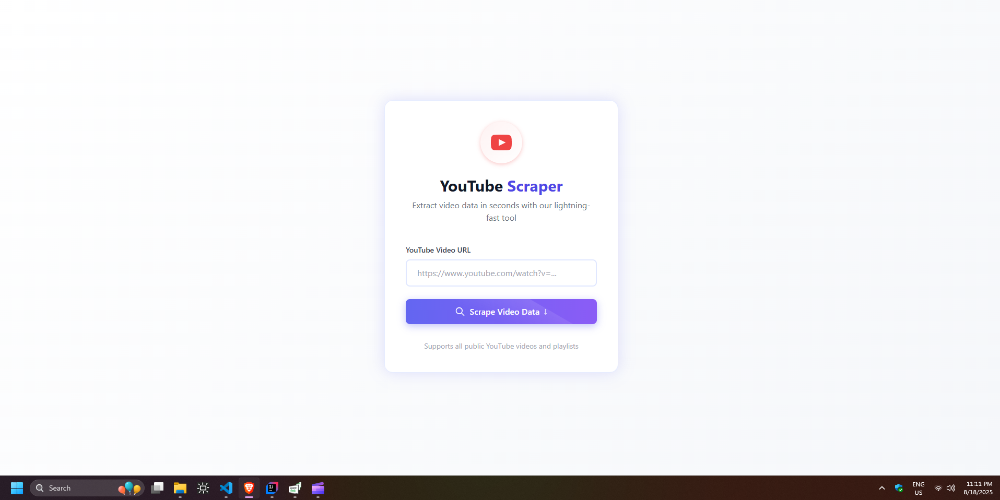
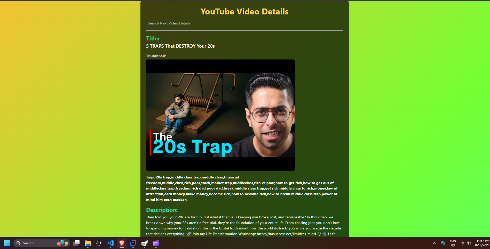

# 🎬 YouTube Scraper (Spring Boot + YouTube Data API)

A **backend-focused project** built with Spring Boot that integrates the YouTube Data API to fetch and display video details like **Title, Thumbnail, Tags, and Description**.  

---
## 🚀 Features
- Fetch YouTube video details using YouTube Data API
- Extracts Title, Thumbnail, Tags, and Description
- Backend built with Spring Boot (API integration + JSON handling)
- Frontend pages (Login, Result, Error) designed with AI-assisted UI (ChatGPT help)
- Simple and clean project structure
---

- ## ⚙️ Tech Stack
- Java
- Spring Boot
- YouTube Data API (REST API)
- JSON
- Thymeleaf (AI-assisted frontend)
---
## 📸 Screenshots


## 📸 Screenshots


- ## ▶️ How to Run
- Clone this repo:
   ```bash
   git clone https://github.com/riteshdawale02/youtube-scraper-springboot.git
   
- Open in your IDE (IntelliJ/Eclipse)
- Add your YouTube Data API Key
- Run the project
---
   ## 📚 What I Learned
- How APIs work (request, response, and integration with Spring Boot)
- Parsing JSON and converting it into Java objects
- Designing clean backend logic for real-world API usage
- Using AI models to assist in frontend design

   #springboot #java #youtubeapi #restapi #backenddevelopment #json
